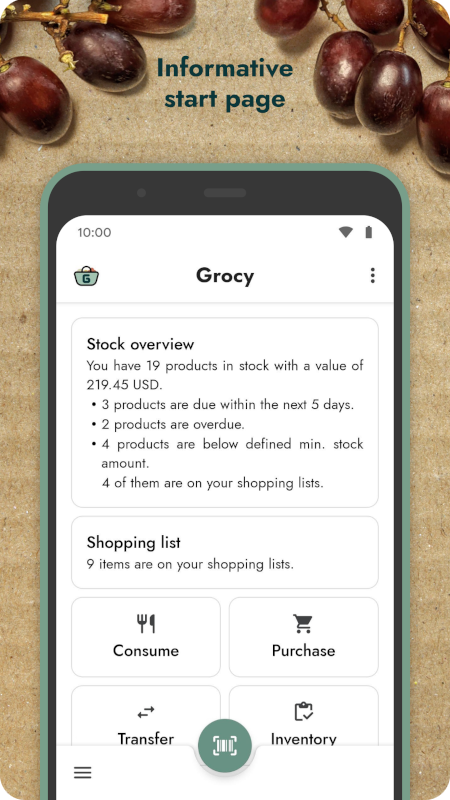
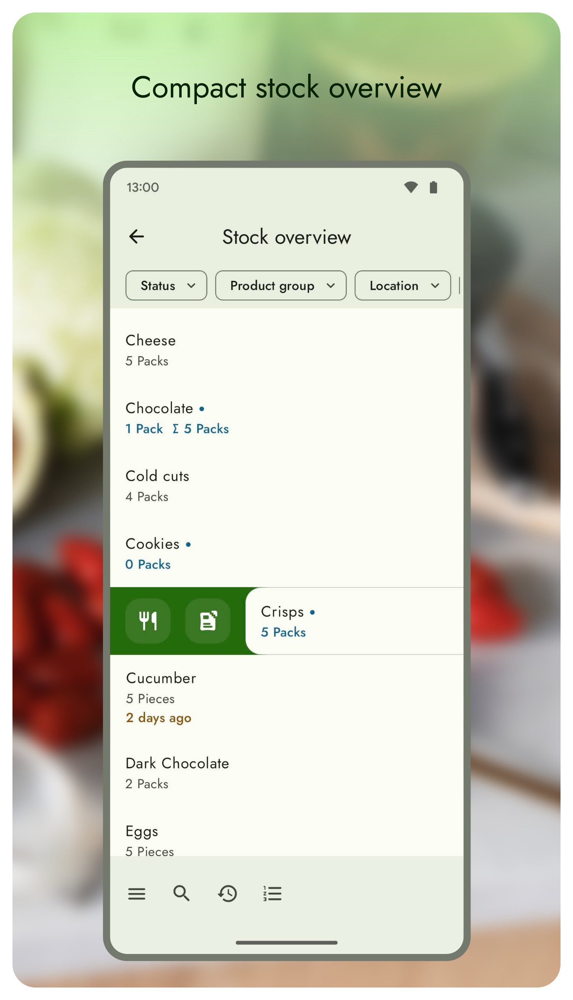
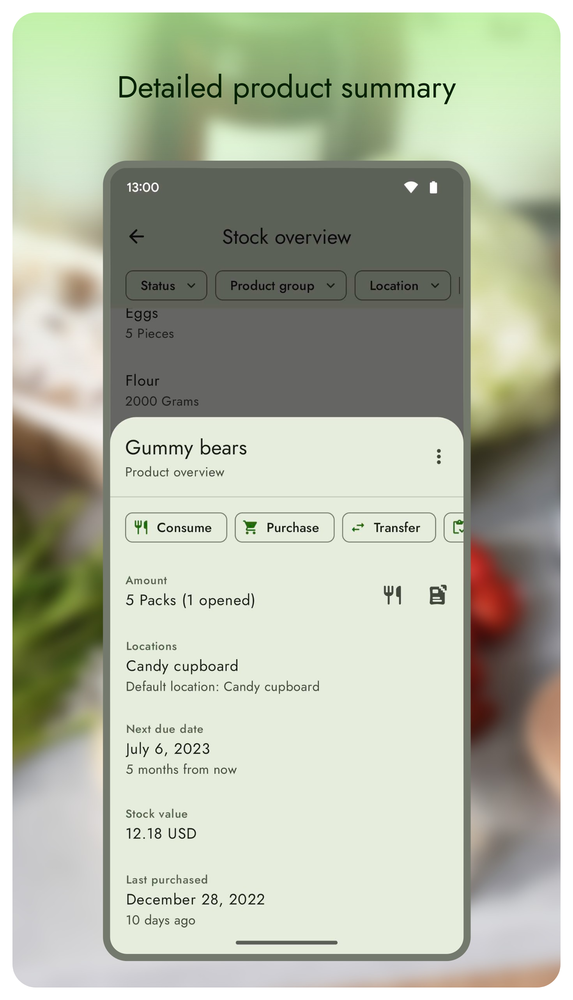
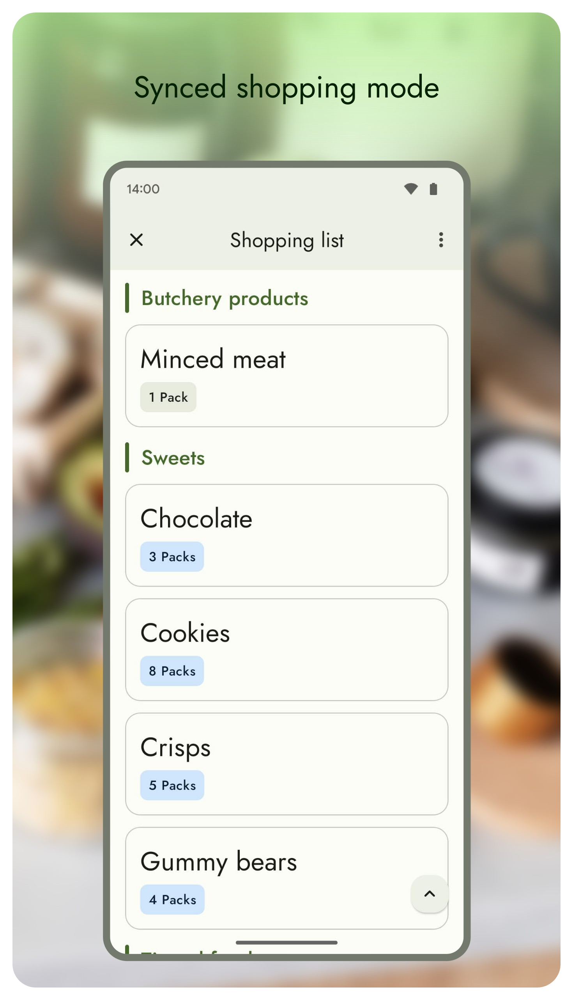

# Grocy Android

     

Grocy Android is an open-source Android client for [grocy](https://grocy.info/) ([source code](https://github.com/grocy/grocy)), a self-hosted grocery and household management solution for your home.

Grocy Android uses grocy's official API to provide you a beautiful interface on your smartphone with powerful barcode scanning and intuitive batch processing, all what you need to efficiently manage your groceries.

**This app requires a running self-hosted instance of the [grocy server application](https://grocy.info/).**  
It is a **companion** app, therefore it **cannot run standalone** or manage products itself.  
You can try it using the demo option available on the login screen.

iOS/macOS client for grocy: [Grocy-SwiftUI](https://github.com/supergeorg/Grocy-SwiftUI)

## Downloads

If you want to try new features right after development, you can download an unsigned [nightly build APK](https://github.com/patzly/grocy-android/releases/tag/nightly) for that.

## Screenshots

## Features

* Stock overview
* Shopping lists with offline support
* In-store shopping mode (big UI elements)
* Fast barcode scanning
* OpenFoodFacts/OpenBeautyFacts implementation
* Master data editing
* Dark mode and dynamic color support
* No ads or analytics

## Compatibility

Grocy Android requires at least Android 5.0 Lollipop and works properly on devices without any Google service installed.

It is also possible to use the grocy Add-on on a [Hass.io](https://www.home-assistant.io/hassio/) server. Click [here](https://github.com/patzly/grocy-android/blob/master/FAQ.md#user-content-faq4) for instructions.

This app supports `https` encryption
- if your server uses a certificate which is signed by a public and trusted [certificate authority (CA)](https://en.wikipedia.org/wiki/Certificate_authority). To meet this requirement, you can use a free certificate from [letsencrypt.org](https://letsencrypt.org/) for your server. Old Android devices can have problems with newer CAs because their internal list of trusted CAs can be outdated if they don't receive system updates anymore, therefore we've integrated [Conscrypt](https://github.com/google/conscrypt/#readme) into the app to support current CAs on all Android versions.
- if your server uses a self-signed certificate. In this case the certificate must be stored in the Android user certificate store.

## FAQ

Please see the in-app help dialog or the [FAQ](https://github.com/patzly/grocy-android/blob/master/FAQ.md) for a list of frequently asked questions.

## Contribution

If you run into a bug or miss a feature, please [open an issue](https://github.com/patzly/grocy-android/issues) in this repository.

For a quick repository overview please refer to [build, module, class and other diagrams](https://sourcespy.com/github/patzlygrocyandroid/). 

Like the grocy project, Grocy Android can be translated, too. The main language is English, but we also maintain the German translation because it's our mother tongue.
You can help translate this project at [Transifex](https://app.transifex.com/patzly/grocy-android), if your language is incomplete, contains typos or is not available yet. Translations which reached a completion level of 80% will be included in releases.  

Translated languages (20): Catalan, Czech, German, Spanish, Estonian, French, Hungarian, Italian, Hebrew, Norwegian Bokmål, Dutch, Polish, Portuguese (Brazil), Portuguese (Portugal), Russian, Slovak, Swedish, Ukrainian, Chinese (China), Chinese (Taiwan)

Thanks for your contributions!

## About

This app is a project of my brother [Dominic Zedler](https://github.com/dominiczedler) and me, [Patrick Zedler](https://github.com/patzly). We started working on it during the first months of the Corona pandemic in Germany, just before our Abitur in 2020, when the schools had to close.

We'd like to thank the developer of grocy, [Bernd Bestel](https://berrnd.de/), without whose great work this app would never have been possible.

## License

Copyright &copy; 2020-2023 Patrick Zedler & Dominic Zedler. All rights reserved.

[GNU General Public License version 3](https://www.gnu.org/licenses/gpl.txt)

> Grocy Android is free software: you can redistribute it and/or modify it under the terms of the GNU General Public License as published by the Free Software Foundation, either version 3 of the License, or (at your option) any later version.
>
> Grocy Android is distributed in the hope that it will be useful, but WITHOUT ANY WARRANTY; without even the implied warranty of MERCHANTABILITY or FITNESS FOR A PARTICULAR PURPOSE. See the GNU General Public License for more details.
